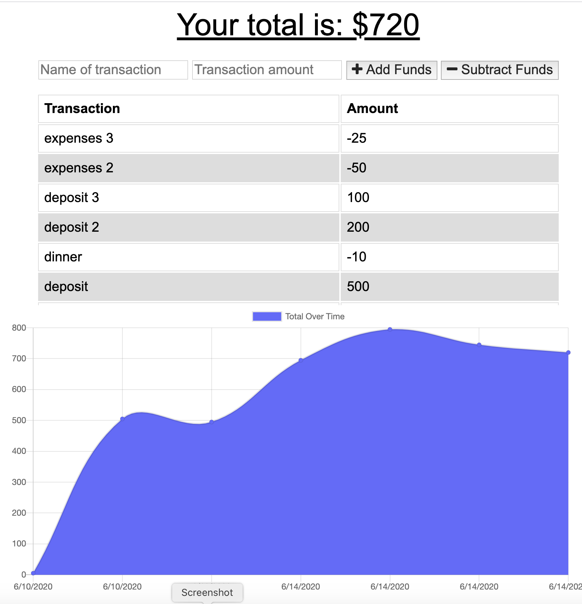

# Budget Tracker

This budgeting application is a progressive web app (PWA) that keeps track of deposits/expenses and allows users to add and save transactions while offline. The total is updated when online again.

## [Tracker Application Deployed on Heroku](https://intense-spire-67552.herokuapp.com/)

## Technology Stack

HTML, CSS, JS, Express, Mongo, Mongoose, Git

## Deployment

1. Clone the application
2. Run "npm i" or "npm install"
3. Run node server to start app

## Test

Open deployed app (link above), go to Network tab (inspect panel), toggle between online and offline settings

## Contact

<li><a href="https://github.com/kristincenters">GitHub</a></li>
<li><a href="https://www.linkedin.com/in/kristincenters">LinkedIn</a></li>
<li><a href="mailto:kristincenters@gmail.com">Email</a></li>
